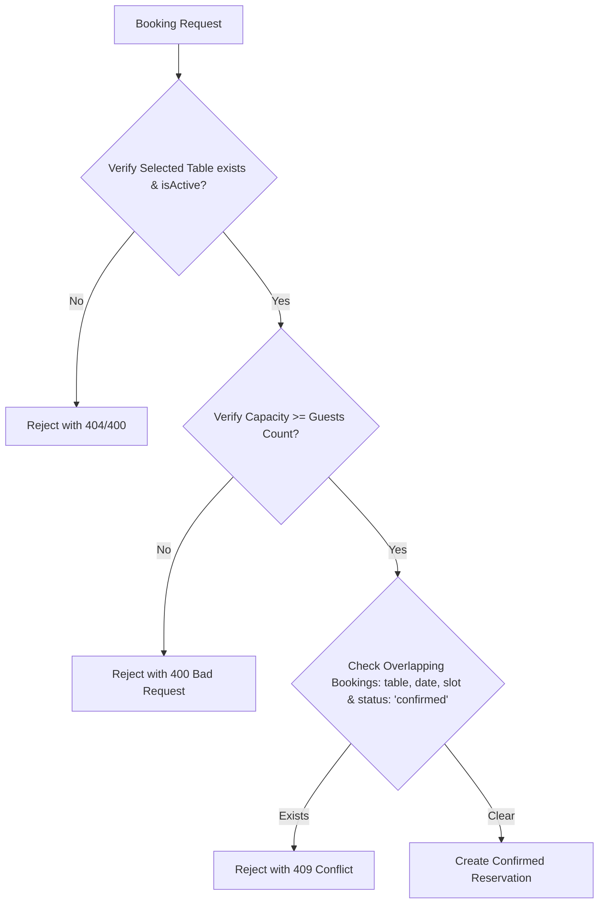

# GourmetReserve - Restaurant Reservation Management System

A high-fidelity, full-stack **Restaurant Reservation Management System** built with **React** (frontend), **Node.js/Express** (backend), and **MongoDB** (database). 

The system implements role-based access control (RBAC), double-booking validation, and an interactive restaurant floor map visualization.

---

## Technical Stack

* **Frontend**: React (with Vite), React Router DOM (for routing), Lucide React (for icons)
* **Backend**: Node.js, Express, JSON Web Token (for authentication), BcryptJS (for password hashing)
* **Database**: MongoDB (via Mongoose ORM)
* **Deployment Friendly**: Served as a single unified service (backend serves frontend static assets in production mode)

---

## Key Features & Rationale

### 1. Zero-Setup Local Development (Dual Database Modes)
To allow immediate, friction-free evaluation without database installation steps:
* **In-Memory Mode (Default)**: If no `MONGODB_URI` is supplied in the `.env` file, the backend spins up an in-memory MongoDB database using `mongodb-memory-server`. It automatically seeds 8 dining tables and 2 default user roles (Admin & Customer).
* **Persistent Mode**: If `MONGODB_URI` is provided, Mongoose connects to your local instance or MongoDB Atlas cluster. Seeding is safely triggered if the table registry is empty.

### 2. Interactive Floor Plan Map
Instead of selecting tables from a simple text list, customers see a **virtual floor map** corresponding to the table grid.
* **Green (Available)**: Free table that fits the guest count. Clicking it selects it instantly.
* **Red (Booked)**: Reserved by another customer for that date & time slot. Unclickable.
* **Gray (Under Capacity)**: Table capacity is too small for the selected guest count. Unclickable.
* **Accurate States**: Changing the date, timeslot, or guest count dynamically re-renders the map with corresponding statuses.

### 3. Role-Based Access Control (RBAC)
* **Customer**: Can book tables, view their own history, and cancel upcoming reservations.
* **Administrator**: Enters a separate control dashboard. Can view all bookings, filter by date, override/cancel reservations, and add/delete tables in real-time. Deletion of a table is prevented if it has active confirmed bookings.

---

## Setup & Running Instructions

### Prerequisites
* **Node.js**: v18.0.0 or higher (Tested on v24)
* **npm**: v9.0.0 or higher

### Local Installation

1. **Clone the repository** (or navigate to the project directory):
   ```bash
   cd restaurant-reservation
   ```

2. **Install all dependencies** (installs both root, backend, and frontend packages):
   ```bash
   npm run install-all
   ```

3. **Configure Environment Variables (Optional)**:
   Create a `.env` file in the `backend/` directory if you wish to use an external database (e.g., MongoDB Atlas). If you don't create one, the system will use the in-memory database automatically!
   ```env
   # backend/.env
   PORT=5000
   MONGODB_URI=mongodb+srv://<username>:<password>@cluster.mongodb.net/gourmet-reserve
   JWT_SECRET=yoursupersecuresecretkey
   ```

4. **Start Development Servers**:
   Run the following command at the root directory to spin up the Express API and the Vite React server concurrently:
   ```bash
   npm run dev
   ```
   * Frontend: `http://localhost:5173/`
   * Backend: `http://localhost:5000/`

5. **Log In with Pre-Seeded Accounts**:
   * **Customer**: `customer@gmail.com` / `customerpassword`
   * **Admin**: `admin@restaurant.com` / `adminpassword`

---

## Deployment (Production Setup)

This repository is optimized for deployment on standard hosting providers:

### Render Deployment (Recommended - Unified Web Service)
1. Log in to [Render](https://render.com/) and create a new **Web Service**.
2. Link this GitHub repository.
3. Configure the following build settings:
   * **Runtime**: `Node`
   * **Build Command**: `npm run install-all && npm run build`
   * **Start Command**: `npm start`
4. Add the following Environment Variables in the **Environment** tab:
   * `NODE_ENV`: `production`
   * `JWT_SECRET`: `yoursupersecuresecretkey`
   * `MONGODB_URI`: `mongodb+srv://<username>:<password>@cluster.mongodb.net/gourmet-reserve` (Connect your live MongoDB Atlas database)

---

## Reservation & Availability Logic

### Validation Flowchart


### Auto-Allocation Mode
If a user submits a booking without specifying a table ID, the backend queries the database for active tables that meet the capacity. It cross-references existing bookings for the specified `date` and `timeSlot`, selects the smallest available table that fits the group (to optimize seating efficiency), and commits the reservation.

---

## Role-Based Access Design

Authentication is enforced via JWT. When a user logs in, they receive a signed JWT token which is sent with the `Authorization: Bearer <token>` header for subsequent requests.

* **Authentication Guard (`protect`)**: Extracts the token, verifies the signature, and queries the user profile, appending `req.user` to the request object.
* **Authorization Guard (`authorize('admin')`)**: Restricts routes (such as table modifications, viewing all customer bookings, etc.) to users who have the role `admin` in the database.
* **Data Scoping**: The reservation controller automatically scopes reservation queries. Customers are restricted to seeing records matching their own user ID, whereas admins can query all.

---

## Limitations & Areas for Improvement

* **Fixed Time Slots**: Currently, reservations are restricted to four fixed 2-hour daily slots. In a commercial environment, sliding reservation windows (e.g. any start time with a 2-hour duration limit) are more flexible.
* **Pagination**: The admin view lists all bookings on a single scrollable panel. For larger restaurants, server-side pagination and advanced search filters (by guest name/phone) would be necessary.
* **Real-time Updates**: If two users view the floor map simultaneously, one might book a table that the other is currently looking at. Adding WebSockets (Socket.io) would sync table statuses in real-time.
